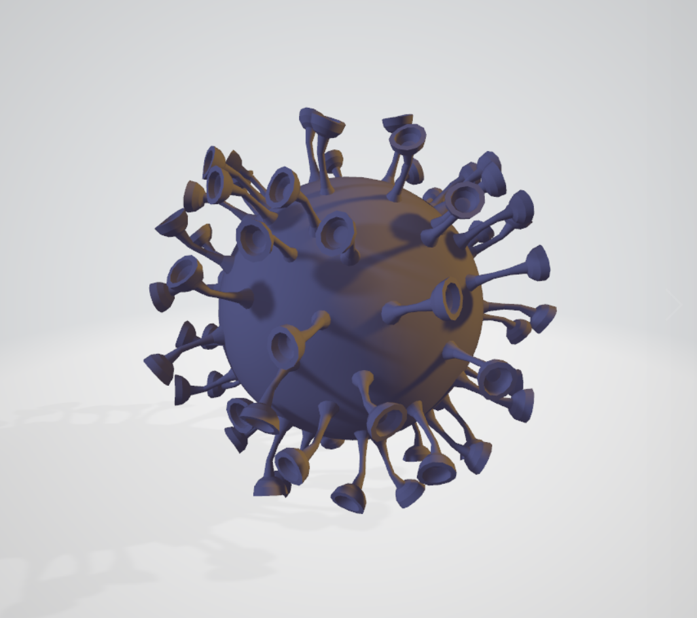

# Introduction: Fire at Coronavirus
This is a computer graphics project created for CSE 167 offered at UCSD. For basic functions and features, check following blogs.

# Blog March 3rd
Today we will introduce some basic ideas and features that will be involved in this project. \
Our project is a game called "Fire at Coronavirus". As SARS-COV-2 virus is spreading globally, we need to recruit someone who can help fight the virus. The player will control a nanometer-level fighter to eliminate the virus in the air. Player as pilot needs to control the craft to avoid the virus and fire nano-bullets to destroy them.\
We currently plan to implement the following features:
1. First-Person view control, whereby the player controls the aircraft.
2. Procedurally generated and animated clouds. These clouds are tiny water drops in the air where virus hide.
3. Collision Detection with arbitrary geometry. We will use this to determine if the fired bullet hits the virus or if the nano-fighter hits on an obstacle or an virus.

We will be creative on simulating the nano-aircraft flight and the coronavirus. Real-looking and fancy textures will be worth looking into. Also there could be other objects flowing in the air that may educates people about the micro-scope world.

The following two images are basic models that we will use (the fighter and the virus).

Finally, credit to our two contributors: Cheng Shen and Manxue Li